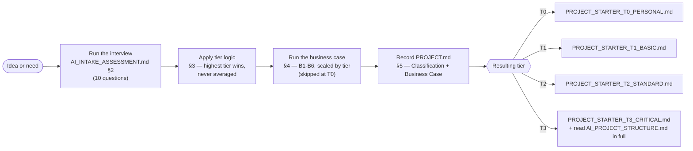
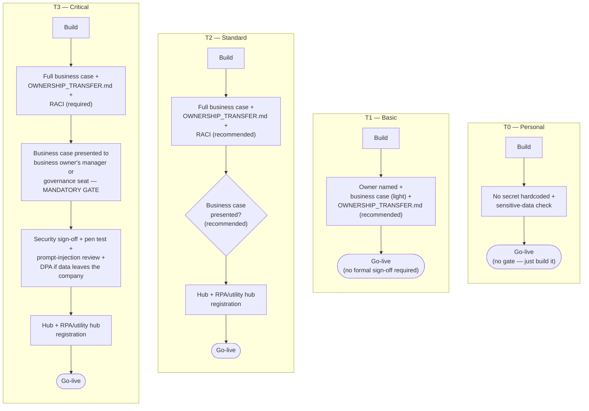
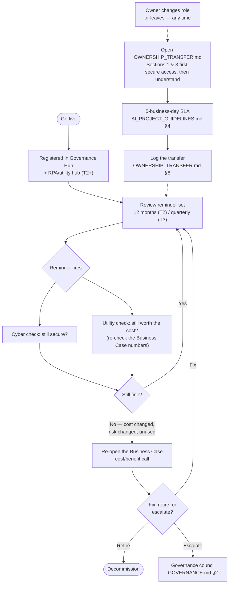

# Process flow — the kit end to end

Every other file in this kit describes one piece of the process in prose: how to classify (`AI_INTAKE_ASSESSMENT.md`), what's required at each tier (`AI_PROJECT_GUIDELINES.md`), who decides what (`GOVERNANCE.md`). None of them show the whole shape at once. This file is that map — four diagrams, one per phase of a project's life, each pointing back to the file that actually defines the step. If a diagram and a file disagree, the file is right and this page has drifted — open an issue/PR (`CONTRIBUTING.md`).

---

## 1. Intake — from idea to a starter in hand



**Where this runs:** the whole lane above is one conversation — `AI_INTAKE_ASSESSMENT.md` Section 1's process, or the same thing invoked in one shot via `.claude/skills/start-ai-project/` on Claude Code. Nobody should be classifying a project and separately hunting for the business-case questions; they're the same interview.

**The one hard rule this diagram hides:** if the project's scope changes materially mid-build (new data source, new users, new integration), you re-enter at box **C** — re-run the tier logic, and say plainly if the tier goes up. It never goes down silently.

---

## 2. Build to go-live — what gates what, by tier

The requirements differ by tier, but the *shape* of the gate is the same everywhere: nothing here is a step you do and forget, it's a condition that must be true before the arrow to "Go-live" is allowed to fire.



**Read this as:** every box that says "MANDATORY GATE" or names an approver is a place where the assistant building the project should stop and get a human answer, not assume one. `PROJECT_STARTER_T3_CRITICAL.md` Section 4 is the literal checklist behind the T3 lane; `AI_PROJECT_GUIDELINES.md` Section 3 is the matrix behind all four.

---

## 3. After go-live — the loop nothing above shows

A project doesn't end at go-live. This is the part most governance write-ups skip, and it's the part `PILLARS_COVERAGE.md` Pillars 5–7 exist to force.



**Two loops, one file each:** the top loop (review cadence) lives in `AI_PROJECT_GUIDELINES.md` Section 5; the ownership loop (dashed lines — it can trigger at any point, not on a schedule) lives entirely in `OWNERSHIP_TRANSFER.md` itself. They're drawn separately because they fire on different triggers, but they read the same underlying record: a stale `OWNERSHIP_TRANSFER.md` is exactly as much of a finding as a missed review.

---

## 4. Who decides — the escalation flow

This is `GOVERNANCE.md` redrawn as a flow instead of a table, for the moments a builder needs "who do I actually ask" faster than reading Section 2 of that file.

```mermaid
flowchart TD
    A(["Question or sign-off needed"]) --> B{{"What tier?"}}
    B -->|T0-T1| C["Self-classify, or ask the<br/>department champion"]
    B -->|T2| D["Any one council seat confirms —<br/>no full-council review needed"]
    B -->|T3 go-live| E["Chair (or backup) +<br/>Security seat —<br/>+ Legal if regulated data"]
    B -->|Disputed tier<br/>or edge case| F["Whichever seat is asked first<br/>defaults to the HIGHER candidate<br/>tier and loops in the Chair"]
    B -->|Kit change<br/>(a PR to this repo)| G["Chair approval always +<br/>Security co-approves if the<br/>change loosens a security rule"]

    C --> H(["Resolved"])
    D --> H
    E --> H
    F --> H
    G --> H

    I["Chair unavailable<br/>> 5 business days"] -.-> J["Security seat becomes<br/>interim Chair for<br/>CODEOWNERS + T3 sign-off"]
    J -.-> K["Joint review of anything<br/>merged during the gap,<br/>at next council meeting"]
```

The four council seats (Chair, Security/Cyber, Legal/Privacy, rotating engineering) and exactly what each one decides are defined in `GOVERNANCE.md` Section 1 — this diagram is a routing table to that file, not a replacement for it.

---

## Keeping this file honest

This page is descriptive, not authoritative — every box names the file that actually governs it, and that file wins on any conflict. Whoever proposes a kit change that alters a gate, a tier, or a council decision (`CONTRIBUTING.md`) should check whether it also moves a box here, the same way a matrix change requires a matching starter update. A flow diagram nobody updates becomes the exact kind of stale documentation this kit exists to prevent (`00_START_HERE.md`, "Why this exists").
